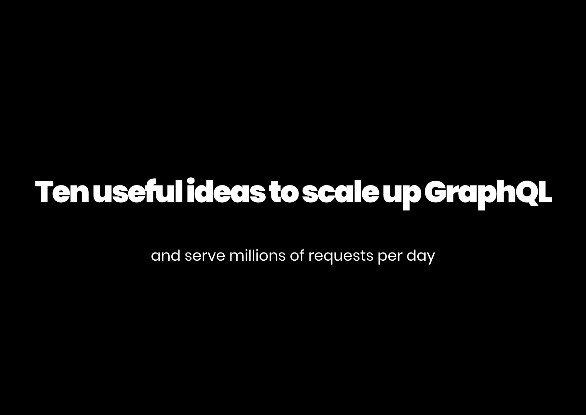

# Deck presented at Boston GraphQL Meetup 04 March 2020

### 10 useful ideas to scale up graphql to serve millions of requests



# Render the Deck

```bash
git clone git@github.com:StymiedSloth/graphql_meetup_slides_032020.git

cd graphql_meetup_slides_032020 

npm install

npm start
```

Visit `https://localhost:8000` to view the slides.

# Misc

## Generate PDF of the deck

```bash
npm start
```
Verify deck is working by visiting `https://localhost:8000`.

In another terminal tab or window
```bash
npx website-pdf http://localhost:8000/print -o deck.pdf
```
